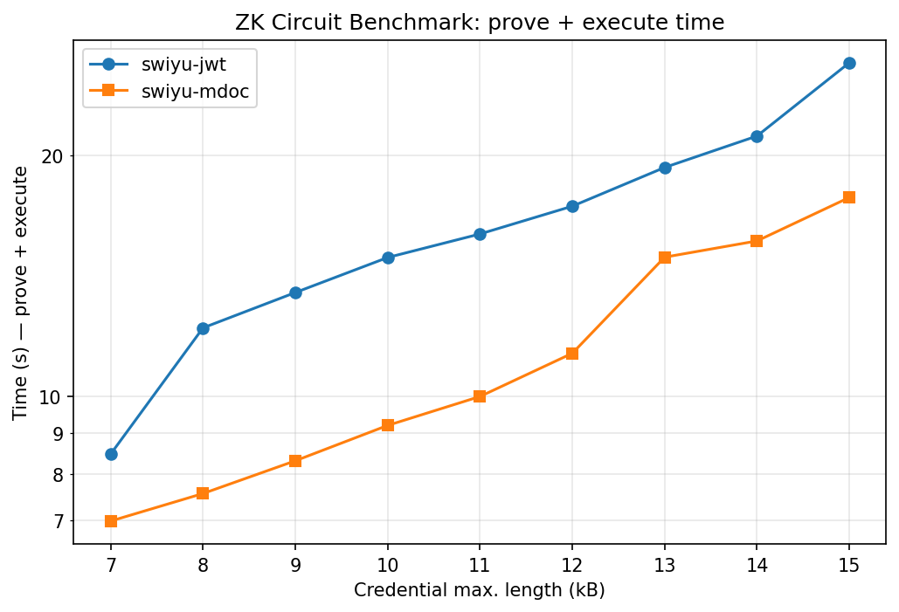

# noir-benchmarks

Benchmark of two zero-knowledge circuits — written in [Noir](https://noir-lang.org/) — that prove the same predicate over a Swiss E-ID (SWIYU) credential in two different formats:

1. **Issuer signature verification** — the credential was signed by a known issuer key.
2. **Holder binding** — the prover controls the device key bound to that credential (signature over a verifier-supplied nonce).
3. **Age verification** — the holder's date of birth meets an age threshold relative to a public "now" input.

The two formats are **JWT** (`circuits/jwt-swiyu`) and **mDoc / ISO 18013-5** (`circuits/mdoc-swiyu`). The benchmark sweeps the maximum supported credential length and records the time spent in each pipeline stage (`nargo compile`, `nargo execute`, `bb write_vk`, `bb prove`, `bb verify`).



## Prerequisites

Easiest path: [Devbox](https://www.jetify.com/devbox/) pins exact versions of `nargo`, `bb`, Rust, and Python.

```sh
devbox shell
```

Manual setup (must match these versions to reproduce the shipped CSVs):

- `nargo v1.0.0-beta.18`
- `bb beta_18` (Barretenberg, version-paired with `nargo`)
- Rust toolchain ≥ 1.85 (the tools crate is edition 2024)
- Python 3 with `matplotlib`

## Run

From a `devbox shell` at the repo root:

```sh
devbox run benchmark   # full sweep, ~30 minutes on a modern laptop
devbox run plot        # reads the latest benchmark-*.csv per circuit, writes scripts/benchmark.png
```

A sample `benchmark-*.csv` is already checked in for each circuit, so `devbox run plot` works immediately without re-running the benchmark.

## Regenerating signed credentials

The committed `Prover.toml` (JWT) and `data/swiyu_IssuerSigned.cbor` (mDoc) are derived from `data/swiyu-eid.json` + `data/issuer.prv` + `data/device.prv`. To regenerate:

```sh
devbox run sign-jwt     # writes a fresh JWT (stdout) — pipe into a new Prover.toml workflow
devbox run build-mdoc   # writes data/swiyu_IssuerSigned.cbor
```

The benchmark then re-derives `Prover.toml` from those artifacts on each sweep step (JWT: pad `payload.storage` to the new `PAYLOAD_MAX_LEN`; mDoc: regenerate the witness with the new `MSO_MAX_LEN`).

## Layout

```
circuits/
  jwt-swiyu/         Noir circuit + Prover.toml + sample benchmark CSV
  mdoc-swiyu/        Noir circuit + Prover.toml + sample benchmark CSV
  mdoc-cbor/         Shared Noir library (CBOR primitives) used by mdoc-swiyu
data/
  swiyu-eid.json     SWIYU credential JSON
  issuer.prv         issuer signing key (PEM)
  device.prv         device-binding key (PEM)
  swiyu_IssuerSigned.cbor   precomputed signed mdoc
tools/               Rust CLI `eid-tools` (jwt + mdoc + bench subcommands)
scripts/
  plot_benchmark.py  matplotlib script that produces benchmark.png
```

## CSV columns

`max_length, nargo_compile, nargo_execute, bb_write_vk, bb_prove, bb_verify` — all in seconds. `max_length` is `PAYLOAD_MAX_LEN` for jwt-swiyu and `MSO_MAX_LEN` for mdoc-swiyu.

## Related

The two circuits and the `eid-tools` harness were extracted from [eid-privacy/noir-experiments](https://github.com/eid-privacy/noir-experiments), which contains the full iteration history (multiple JWT and mDoc experiments, SD-JWT, fixed-credential variants, profiling/plot subcommands, and the development justfile). This repo distills the two final circuits and the bench harness needed to reproduce the headline plot.
